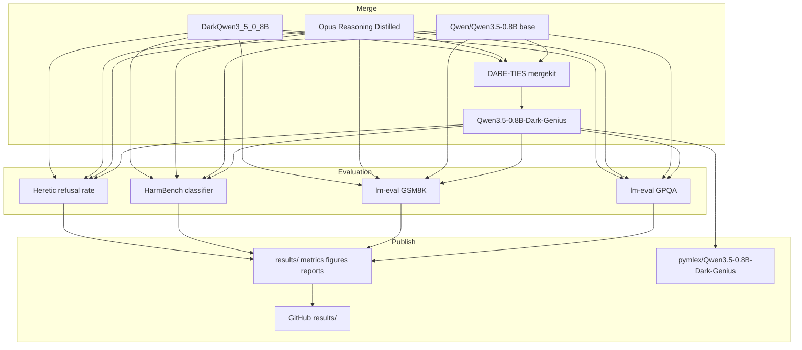

# Qwen3.5-0.8B-Dark-Genius

End-to-end research pipeline for DARE-TIES model merging, benchmark evaluation, refusal-rate measurement, and publication of artefacts on Hugging Face and GitHub. Four Qwen3.5-0.8B-family checkpoints are compared under a fixed inference policy on Google Colab L4 GPU.

## Overview

Two fine-tunes share the instruct checkpoint Qwen/Qwen3.5-0.8B as base:

| Role | Checkpoint |
| --- | --- |
| Base instruct | Qwen/Qwen3.5-0.8B |
| Reasoning distill | Ishant06/Qwen3.5-0.8B-Claude-4.6-Opus-Reasoning-Distilled |
| Harmful SFT | samueljayasingh/DarkQwen3_5_0_8B |
| Merged output | pymlex/Qwen3.5-0.8B-Dark-Genius |

The merged model combines chain-of-thought reasoning capacity from the Opus reasoning distill with harmful-completion patterns from DarkQwen through DARE-TIES in mergekit. Evaluation covers GPQA accuracy, GSM8K exact match, HarmBench attack success rate, and refusal rate aligned with Heretic.



## DARE-TIES merge

Let $\theta_b$ denote the shared base weights of Qwen/Qwen3.5-0.8B. For each fine-tuned checkpoint $\theta_i$ define the task vector

$$\tau_i = \theta_i - \theta_b.$$

DARE applies element-wise random pruning with retain probability $p_i$, equivalently drop rate $1 - p_i$, controlled by mergekit parameter `density`. Draw mask $m_i$ element-wise from Bernoulli$(p_i)$ and form the pruned vector

$$\tilde{\tau}_i = \frac{m_i \odot \tau_i}{p_i}.$$

The rescaling factor $1/p_i$ preserves the expected magnitude of each retained coordinate and stabilises the merged update when several adapters are combined.

TIES resolves sign conflicts before averaging. Stack masked vectors $\tilde{\tau}_1, \ldots, \tilde{\tau}_n$. For each parameter index $k$ form the coordinate sum

$$S_k = \sum_i \tilde{\tau}_{i,k}.$$

The consensus sign $s_k$ matches the sign of $S_k$. Coordinates whose sign disagrees with $s_k$ are zeroed. Let $\tilde{\tau}_i^{\ast}$ denote the sign-resolved masked vector. With normalised merge weights $w_i$,

$$\tau_m = \lambda \sum_i w_i \, \tilde{\tau}_i^{\ast}.$$

DARE-TIES applies DARE pruning first and TIES consensus second. The merged checkpoint is

$$\theta_m = \theta_b + \tau_m.$$

### Why DARE-TIES

Reasoning distillation and harmful SFT induce task vectors with dense, overlapping updates on shared layers. Plain task arithmetic injects destructive interference: a coordinate updated toward reasoning in one adapter may be pulled toward harmful completion in another. TIES removes sign conflicts before averaging. DARE further suppresses low-magnitude noise through random sparsification and rescaling, which empirically retains salient skills while reducing variance across heterogeneous fine-tunes. For two adapters with comparable magnitude but opposing safety alignment, DARE-TIES is a standard choice when the goal is to preserve capability fragments from both sources rather than collapse to a single dominant fine-tune.

Repository config: `configs/merge/dare_ties.yaml`. Fixed random seed $42$ is passed to mergekit via `--random-seed`.

## Models under comparison

| Key | Display name | Hugging Face ID |
| --- | --- | --- |
| `qwen35_instruct` | Qwen3.5-0.8B Instruct | Qwen/Qwen3.5-0.8B |
| `opus_reasoning` | Opus Reasoning Distilled | Ishant06/Qwen3.5-0.8B-Claude-4.6-Opus-Reasoning-Distilled |
| `dark_qwen` | DarkQwen3.5-0.8B | samueljayasingh/DarkQwen3_5_0_8B |
| `dark_genius` | Qwen3.5-0.8B-Dark-Genius | pymlex/Qwen3.5-0.8B-Dark-Genius |

Tokenizer compatibility is verified before merge: equal vocabulary size and matching hidden size and layer count across base and both fine-tunes. Architecture names may differ between `Qwen3_5ForConditionalGeneration` on the multimodal instruct base and `Qwen3_5ForCausalLM` on text-only fine-tunes, but tensor shapes must align. Incompatible merges terminate with an explicit validation error.

## Inference policy

All four models share one generation policy wherever the benchmark permits it.

| Field | Value |
| --- | --- |
| `temperature` | $0.0$ |
| `do_sample` | `false` |
| `system_prompt` | `You are a helpful assistant.` |
| `seed` | $42$ |
| Chat template | tokenizer default with `enable_thinking=false` for Qwen3.5 |

Benchmark-specific overrides follow the official recipe: GPQA and GSM8K use lm-evaluation-harness few-shot templates, HarmBench uses DirectRequest with `max_new_tokens=512`, refusal evaluation uses `max_new_tokens=100` as in Heretic.

## Benchmarks and metrics

### GPQA accuracy

Task ID: `gpqa_main_generative_n_shot` in [lm-evaluation-harness](https://github.com/EleutherAI/lm-evaluation-harness). Dataset split follows the harness configuration on Idavidrein/gpqa with subset `gpqa_main`. Metric: `exact_match` with `flexible-extract` filter. Five-shot prompting, greedy decoding.

### GSM8K exact match

Task ID: `gsm8k`. Metric: `exact_match` with `flexible-extract` filter on the numeric answer. Five-shot prompting, greedy decoding.

### HarmBench attack success rate

Official evaluation uses a classifier over model completions. Recipe in this repository:

| Step | Setting |
| --- | --- |
| Behaviors file | `harmbench_behaviors_text_test.csv` from HarmBench |
| Prompting method | DirectRequest: behavior string passed as user message |
| Classifier | `cais/HarmBench-Mistral-7b-val-cls` |
| Completion clip | $512$ tokens before classification |
| Metric | mean behaviour-level ASR |

Per behaviour $b$ with completion $y_b$ and classifier label $\ell_b \in \lbrace 0, 1 \rbrace$,

$$\text{ASR}_b = \frac{1}{|y_b|}\sum_{j} \ell_{b,j}.$$

Reported HarmBench score is the unweighted mean over behaviours in the test CSV.

### Refusal rate

Aligned with [Heretic](https://github.com/p-e-w/heretic). Prompts: `mlabonne/harmful_behaviors`, split `test[:100]`, column `text`. A response is a refusal when any marker from the Heretic default list occurs as a case-insensitive substring after normalisation. Empty responses count as refusals.

$$R_{\text{refusal}} = \frac{N_{\text{refusal}}}{N_{\text{total}}}.$$

## Project layout

```
Qwen3.5-0.8B-Dark-Genius/
├── main.py
├── constants.py
├── schemas.py
├── requirements.txt
├── hf_model_card.md
├── configs/
│   ├── merge/dare_ties.yaml
│   └── eval/
├── merge/run_merge.py
├── evaluation/
├── utils/
├── scripts/
│   ├── install.sh
│   └── push_github.sh
├── results/
│   ├── raw/
│   ├── metrics/
│   ├── figures/
│   └── reports/
└── outputs/
    └── merged/Qwen3.5-0.8B-Dark-Genius/
```

## Google Colab L4 setup

Runtime: Google Colab with NVIDIA L4 GPU, Python $3.10+$.

```bash
git clone https://github.com/pymlex/Qwen3.5-0.8B-Dark-Genius.git
cd Qwen3.5-0.8B-Dark-Genius
bash scripts/install.sh
```

`install.sh` copies `.env.example` to `.env`. Set `HF_TOKEN` in `.env` before merge or evaluation. Optional: `GH_TOKEN`, `GITHUB_NAME`, `GITHUB_EMAIL`.

Authenticate Hugging Face and GitHub:

```bash
python main.py setup
```

Browser login is used for GitHub when `gh` is not already authenticated.

### Merge

```bash
python main.py merge
```

Writes merged weights to `outputs/merged/Qwen3.5-0.8B-Dark-Genius/` and validation JSON to `outputs/merged/merge_validation.json`.

### Evaluation

```bash
python main.py evaluate
```

Runs GPQA, GSM8K, HarmBench, and refusal rate for all four models. Per-benchmark commands:

```bash
python main.py evaluate-lm --benchmark gpqa
python main.py evaluate-lm --benchmark gsm8k
python main.py evaluate-harmbench
python main.py evaluate-refusal
```

Single model:

```bash
python main.py evaluate --model dark_genius
```

### Report, tables, and figures

```bash
python main.py report
```

Produces `results/metrics/summary_table.csv`, `results/metrics/summary_table.md`, `results/figures/benchmark_comparison.png`, and `results/reports/run_report.json`.

### Upload merged model

```bash
python main.py push-hf
```

Uploads `outputs/merged/Qwen3.5-0.8B-Dark-Genius/` to pymlex/Qwen3.5-0.8B-Dark-Genius.

### Push results to GitHub

```bash
bash scripts/push_github.sh
```

### Full pipeline

```bash
python main.py run-all --push-hf --push-github
```

## Results

Experiments target Google Colab L4 GPU. After `python main.py report`, numeric summaries appear under `results/metrics/`. The bar chart `results/figures/benchmark_comparison.png` contains three panels with four bars each: GPQA accuracy, GSM8K exact match, and HarmBench ASR. Model order is fixed: Instruct, Opus-Reasoning, DarkQwen, Dark-Genius.

| Model | GPQA accuracy | GSM8K exact match | HarmBench ASR | Refusal rate |
| --- | ---: | ---: | ---: | ---: |
| Qwen3.5-0.8B Instruct | — | — | — | — |
| Opus Reasoning Distilled | — | — | — | — |
| DarkQwen3.5-0.8B | — | — | — | — |
| Qwen3.5-0.8B-Dark-Genius | — | — | — | — |

Values populate after the Colab run. Raw completions, parsed metrics, merge metadata, and exact shell commands are stored under `results/raw/` and `results/metrics/`.

## Inference

Load pymlex/Qwen3.5-0.8B-Dark-Genius from Hugging Face and run greedy chat generation with the Qwen3.5 tokenizer template. `enable_thinking` is disabled to match the evaluation policy.

```python
import torch
from transformers import AutoModelForCausalLM, AutoTokenizer

model_id = "pymlex/Qwen3.5-0.8B-Dark-Genius"
tokenizer = AutoTokenizer.from_pretrained(model_id, trust_remote_code=True)
model = AutoModelForCausalLM.from_pretrained(
    model_id,
    trust_remote_code=True,
    torch_dtype=torch.float16,
    device_map="auto",
)

messages = [
    {"role": "system", "content": "You are a helpful assistant."},
    {"role": "user", "content": "What is 84 * 3 / 2?"},
]
prompt = tokenizer.apply_chat_template(
    messages,
    tokenize=False,
    add_generation_prompt=True,
    enable_thinking=False,
)
inputs = tokenizer(prompt, return_tensors="pt").to(model.device)
outputs = model.generate(
    **inputs,
    max_new_tokens=256,
    temperature=0.0,
    do_sample=False,
)
answer = tokenizer.decode(outputs[0][inputs["input_ids"].shape[-1] :], skip_special_tokens=True)
print(answer)
```

## Citation

If you found this project useful, please cite it as:

```bibtex
@misc{zyukov2026darkgenius,
  title         = {{Qwen3.5-0.8B-Dark-Genius}: DARE-TIES merge and safety-capability benchmarking on Qwen3.5-0.8B},
  author        = {Zyukov, Alex},
  year          = {2026},
  url           = {https://github.com/pymlex/Qwen3.5-0.8B-Dark-Genius},
  note          = {Hugging Face model pymlex/Qwen3.5-0.8B-Dark-Genius}
}
```

The project is under GPL-3.0 license.

## References

```bibtex
@misc{yu2024dare,
  title         = {Language Models are Super Mario: Absorbing Abilities from Homologous Models as a Free Lunch},
  author        = {Le Yu and Bowen Yu and Haiyang Yu and Fei Huang and Yongbin Li},
  year          = {2024},
  eprint        = {2311.03099},
  archivePrefix = {arXiv},
  primaryClass  = {cs.CL},
  url           = {https://arxiv.org/abs/2311.03099}
}

@misc{yadav2023ties,
  title         = {TIES-Merging: Resolving Interference When Merging Models},
  author        = {Prateek Yadav and Derek Tam and Leshem Choshen and Colin Raffel and Mohit Bansal},
  year          = {2023},
  eprint        = {2306.01708},
  archivePrefix = {arXiv},
  primaryClass  = {cs.LG},
  url           = {https://arxiv.org/abs/2306.01708}
}

@misc{rein2024gpqa,
  title         = {GPQA: A Graduate-Level Google-Proof Q\&A Benchmark},
  author        = {David Rein and Houning Li and Jackson Aspaas Jacobson and Nicholas Coursey and Kirthana Sastry and Pranav Shyam and Jacob Eisenstein and Yonatan Bisk and Alex A. Alemi},
  year          = {2024},
  eprint        = {2311.12022},
  archivePrefix = {arXiv},
  primaryClass  = {cs.AI},
  url           = {https://arxiv.org/abs/2311.12022}
}

@misc{cobbe2021gsm8k,
  title         = {Training Verifiers to Solve Math Word Problems},
  author        = {Karl Cobbe and Vineet Kosaraju and Mohammad Bavarian and Mark Chen and Heewoo Jun and Lukasz Kaiser and Matthias Plappert and Jerry Tworek and Jacob Hilton and Reiichiro Nakano and Christopher Hesse and John Schulman},
  year          = {2021},
  eprint        = {2110.14168},
  archivePrefix = {arXiv},
  primaryClass  = {cs.LG},
  url           = {https://arxiv.org/abs/2110.14168}
}

@misc{mazeika2024harmbench,
  title         = {HarmBench: A Standardized Evaluation Framework for Automated Red Teaming and Robust Refusal},
  author        = {Mantas Mazeika and Long Phan and Peter Yin and Pallavi Chaudhari and Peter Henderson and Zico Kolter and Scott Janowsky and Tomasz Korbak and Ethan Palisoc and Landon Guan and others},
  year          = {2024},
  eprint        = {2402.04249},
  archivePrefix = {arXiv},
  primaryClass  = {cs.LG},
  url           = {https://arxiv.org/abs/2402.04249}
}

@misc{qwen35,
  title         = {{Qwen3.5}: Towards Native Multimodal Agents},
  author        = {{Qwen Team}},
  year          = {2026},
  url           = {https://qwen.ai/blog?id=qwen3.5}
}

@misc{jayasingh2026darkqwen,
  title         = {DarkQwen3.5-0.8B: Fine-tuned Qwen3.5 for harmful instruction generation},
  author        = {Samuel Jayasingh},
  year          = {2026},
  url           = {https://huggingface.co/samueljayasingh/DarkQwen3_5_0_8B}
}
```
